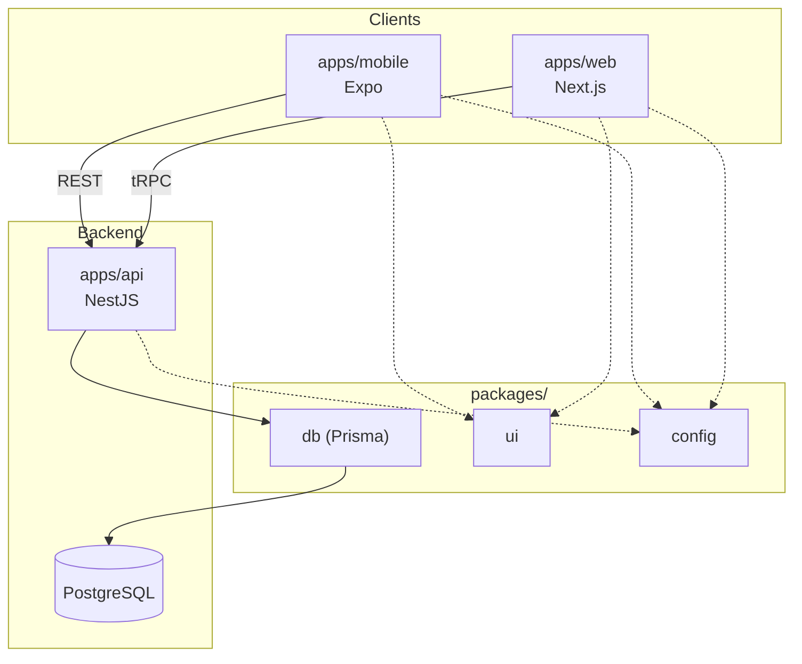
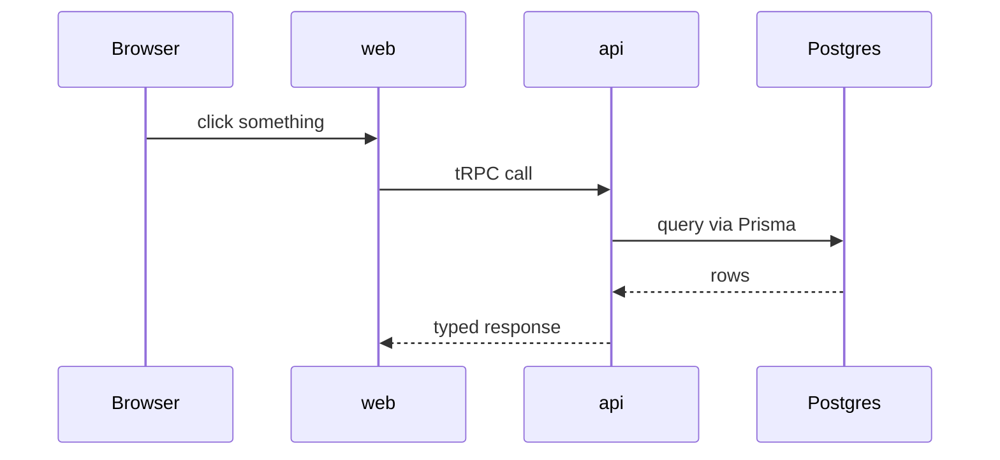
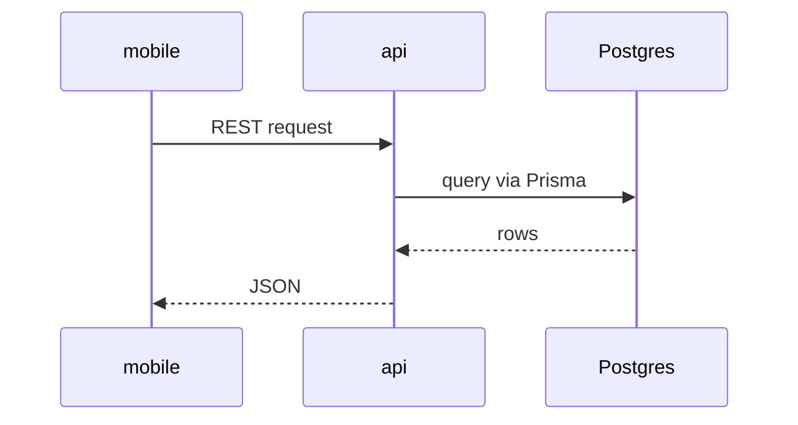

# Architecture

This is a quick tour of how openevents fits together — what talks to
what, and why we made a few of the calls we made. If you're about to
open your first PR, this should be enough context to know where your
change belongs.

## The pieces



Web is Next.js. Mobile is Expo, so it's the same React mental model
as the web app instead of a whole separate ecosystem. Both eventually
talk to one NestJS API, which is the only thing that touches the
database.

It's all one Turborepo repo. That's mostly for the shared packages —
one place for the DB schema, one place for shared UI, one place for
config — so a feature that touches three apps can still be one PR.

## Why web talks tRPC but mobile talks REST

They're the same backend, just reached two different ways.

Web is TypeScript talking to TypeScript, so it goes through tRPC —
you get full type-checking on API calls for free, and if someone
changes a field on the backend, the frontend breaks at build time
instead of in production. That matters more as more people are
shipping features in parallel.

Mobile, and anything outside the monorepo (third-party integrations,
a future public API), can't use tRPC — it's TS-to-TS only. So the API
also exposes a normal REST layer with OpenAPI docs, for anything that
isn't "our own frontend."





## The database

Postgres, accessed only through Prisma, only from `apps/api`. Nothing
else talks to the DB directly — that's the one rule worth keeping.

The schema (`packages/db/prisma/schema.prisma`) covers the core domain models:
- **Auth & Organizers**: `User`, `Account`, `Session`, `Organizer`, `OrganizerMember`.
- **Events & Ticketing**: `Event`, `Ticket` (tier config), `IssuedTicket` (attendee pass & QR token), `TicketTransfer` (secure claim delegation).
- **RSVP & Attendee Management**: `RsvpForm`, `CustomQuestion`, `RsvpSubmission`, `RsvpCheckIn`.
- **CFP (Call for Proposals)**: `CfpForm`, `CfpCustomQuestion`, `CfpSubmission`, `CfpReview`.
- **Program & Schedule**: `ScheduleItem` (multi-day session scheduling, stages/tracks, proposal linking).
- **Sponsors & Ecosystem Partners**: `EventPartner` (sponsor tiers, community partners, logo & website showcases).
- **Team & Volunteers**: `EventVolunteer` (core organizers, registration desk staff, stage managers, helpers).

## Auth

Powered by NextAuth with JWT strategies and tRPC auth context, supporting credentials and OAuth identity providers (OpenEvents, Google, GitHub).

## Running it locally

```
docker compose up -d      # postgres, on host port 5433
pnpm approve-builds        # once per machine
pnpm --filter web dev
```

`packages/db/.env` and `apps/api/.env` hold your local DB connection
string. They're gitignored — copy `.env.example` if you're setting
this up fresh.

## Why this stack

Short version: this is close to how Cal.com is put together, which
is the closest comparison we have — open source, self-hostable,
scheduling instead of ticketing, but the same kind of "many outside
contributors" problem. Next.js, NestJS, Prisma, Postgres, tRPC +
REST, all TypeScript. We're borrowing a structure that's already
been proven to hold up with a lot of contributors, rather than
inventing our own.

## Still open

- Auth: NextAuth, Supabase Auth, or something custom
- Payments: probably Razorpay given the India-first audience, not
  locked in
- Whether `apps/api` ever needs to deploy separately from `apps/web`,
  or if that's premature for now
